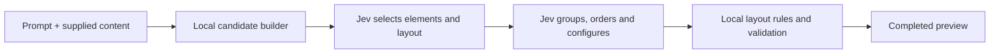
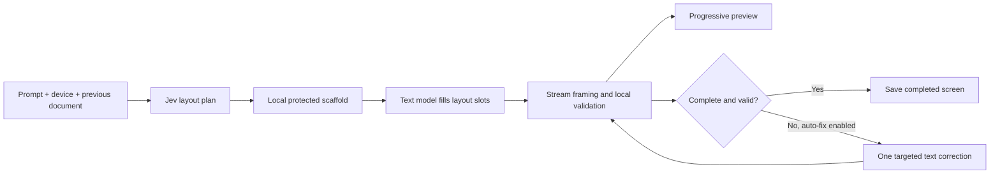

# Jeverative

Generate interfaces from a prompt using your component library. Jeverative combines Jev decisions and styled shadcn/ui components in a responsive playground.

[Open Jeverative](https://jeverative-ui.vercel.app) · [GitHub](https://github.com/hckmstrrahul/jeverative-ui)

## Two ways to compose

| | Jev-first | Adaptive |
| --- | --- | --- |
| Best for | Composing within the prepared library | Prompt-specific content and more open-ended interfaces |
| Jev owns | Element selection, layout, grouping, order and supported property choices | Page arrangement, density and surfaces |
| Content | Prepared samples or supplied fields and datasets | A text model writes content, nesting and bindings using registered components |
| Calls | 1–2 Jev calls | 1 Jev call + 1 text call; up to 1 extra text correction |
| Preview | Loading state, then one completed composition | Streamed drafts, followed by a validated completed screen |

Neither mode creates new React components or executes generated JavaScript. Both render a validated document through the same local component adapters.

### Jev-first

The candidate builder exposes reusable elements and semantic groups with known properties, data and actions. Jev chooses among these options; local code constructs the document and enforces responsive layout and reading order. Simple compositions can skip the second call.

Supplied names, copy, fields, metrics, charts and tables can replace sample content. Property configuration is bounded: Jev chooses supported values rather than inventing arbitrary props. Variations preserve selected content while changing eligible arrangements and grouping. No text model is called, including when a request is unsupported.

### Adaptive

Jev chooses the page arrangement, density and surfaces. The local compiler creates protected layout nodes. The selected text model fills their slots with registered components, labels, sample data and interaction bindings.

Local normalization runs before paid correction. If validation still fails and **Auto-fix invalid output** is enabled, the same text model gets one targeted repair attempt. Jev is not called again. A failed attempt retains the previous completed screen; an unfinished draft is labelled. The app does not silently switch engines or upgrade models.

## Shared rendering layer

Both architectures use registered React components, with styling applied to typography, colors, spacing and responsive layouts. Local validation checks component properties, document structure and interaction bindings before a completed screen is saved.

The renderer supports desktop, tablet and mobile previews. Interactions run locally as prototypes; neither architecture creates a business backend or executes model-generated JavaScript.

## Choosing an architecture

**Jev-first** is for interfaces that can be expressed with the prepared component vocabulary and supplied data. It avoids text generation, but cannot invent unrestricted content or new component implementations.

**Adaptive** is for requests needing more prompt-specific copy, data and component combinations. It keeps Jev’s layout plan while adding text generation and, when necessary, a bounded repair step.

Compare relevance, layout, interactions, completion rate, latency and cost per usable screen. Valid output alone does not establish design quality, and the two architectures offer different levels of content flexibility.
