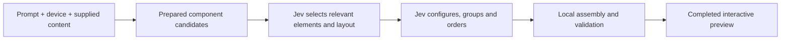
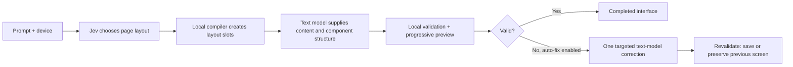

# Jeverative

A Jev-powered generative UI playground. Describe an interface and Jev selects, configures and arranges prepared components into a working preview—without a separate text-generation model in the default flow.

[Try Jeverative](https://jeverative-ui.vercel.app)

## Jev-first: the default

Jev makes the composition decisions. A prepared library supplies styled shadcn/ui components, sample content, supported property choices and prototype interactions. Local code builds and validates the resulting interface.

The engine batches decisions into **1–2 Jev calls**. Simple compositions can skip the second call. It selects existing components and supported values rather than generating React code or streaming a new component tree from a text model.

**How fast?** A live desktop flight-booking generation on the production site completed in **1.18 seconds** on September 21, 2026. A separate server check completed in **1.06 seconds** with two Jev calls. These are individual observations, not a benchmark average or latency guarantee; prompt complexity, provider response time and network conditions affect results. The preview displays each run’s generation time.

### What it can compose

- Profiles, settings, dashboards, portfolios, planners and checkout interfaces.
- Stock and crypto detail pages with price charts, holdings, performance, market depth and docked Buy/Sell actions.
- Mutual funds/SIP, banking/transfers, credit repayments, budgets, merchant invoices/settlements, insurance and identity verification prototypes.
- Personal portfolio websites with projects, about, expertise and contact groups, separate from investment portfolios.
- Discovery and social feeds, composers, navigation and inbox panes.
- Booking interfaces for flights, trains, buses, car rentals, restaurants, events and appointments.
- Interfaces using supplied names, copy, fields, metrics, charts and tabular data.

Desktop, tablet and mobile prompts adapt the preview dimensions and layout rules. Variations reuse selected content while changing eligible arrangements and property choices. During generation, the canvas shows progress before presenting the completed composition.

Coverage comes from the prepared library and supplied data. Jev-first does not invent arbitrary components or unrestricted copy. Search, booking and payment controls are interactive prototypes; they do not connect to live inventory or business backends.

## Hybrid: the secondary option

Choose **Hybrid** in the connection modal when a request needs open-ended copy, data or component combinations beyond Jev-first’s prepared vocabulary. It is a manually selected fallback—not an automatic switch away from Jev-first.

Jev owns the overall arrangement, density and surfaces. The selected text model fills the layout with registered components, labels, sample data and interaction bindings. It uses the same component library; it does not create new React components.

Hybrid uses one Jev planning call and one text-generation call, with at most one additional text correction when enabled. Local normalization runs before paid correction. Failed generation preserves the previous completed screen. Hybrid adds text-model latency and cost; the Jev-first timings above do not describe Hybrid performance.

## Shared renderer and connection

Both paths render validated documents through the same React component adapters, with styling applied to typography, colors, spacing and responsive layouts. Generated interfaces use local prototype interactions and never execute model-generated JavaScript.

OpenRouter requests pass through server routes. Production connects using the configured server-side default key. **Enter your key** lets visitors use their own account instead, with optional storage on their device. The default key stays in sensitive Vercel environment variables and is never sent to the browser or committed to Git.
