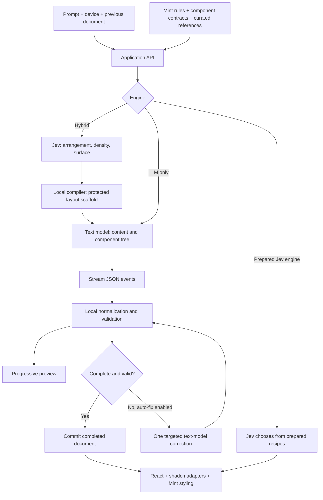

# Jeverative

A generative UI playground with Jev-first composition and optional text-model engines. Describe an interface, watch registered components arrive on the canvas, then refine the result or request a new spatial variation.

**App:** https://jeverative-ui.vercel.app · **Architecture & cost calculator:** https://jeverative-ui.vercel.app/architecture.html

Jeverative renders a validated UI document with React, shadcn/ui adapters, Mint design tokens and Hugeicons. It does not execute model-generated JavaScript.

## Start locally

Requires Node.js 24 and npm.

```sh
npm ci
npm run dev
```

Open the localhost URL printed by the server. Click **Connect OpenRouter**, choose an engine and text model, and enter your own OpenRouter API key. The key lives in React memory for that tab session; reloading clears it. Requests pass through the application server to OpenRouter. Keys are not written to browser storage or intentionally logged.

For trusted local development only, you can instead copy `.env.example` to `.env` and set `OPENROUTER_API_KEY`. Restart the local server after changing it. The hosted deployment is configured without a shared server key: visitors supply their own credits.

The disconnected canvas is empty. Example buttons fill the prompt without generating. Press **Compose** or **Enter** to generate; **Shift+Enter** inserts a line break. There is no auto-compose. Cancelling stops local work and aborts the upstream request, but cannot guarantee that already-consumed provider tokens are unbilled.

## Playground

- Eight detailed example prompts: investing profile/wallets, sales dashboard, tablet task board, account settings, support inbox, investment portfolio, mobile checkout and meeting scheduler.
- Desktop (1440 × 900), tablet (834 × 1112) and mobile (390 × 844) preview profiles. Explicit device intent in the prompt can select the profile.
- A compact activity visualization shows received planning and generation stages, element counts, correction state and completion. It is not a visualization of model reasoning.
- Progressive drafts appear while the text model streams. The last completed document stays saved if a new attempt fails; unfinished drafts are labelled and can be discarded.
- Repeating a prompt requests a variation. Recent Jev arrangements are excluded where alternatives exist; distinct wording or a different spatial request can further change the composition. Variation is not guaranteed to produce a better design.
- Registered controls support local prototype interactions such as bindings, selection and overlays. They do not implement real payments, account changes, authentication or business backends.

## Architecture

The [standalone HTML architecture page](public/architecture.html) includes selectable engine diagrams, an ownership breakdown, historical results and an interactive token-cost calculator. It works without an API key.



The correction loop has a hard limit of one additional text-model attempt. It does not continue indefinitely.

### Who does what?

| Layer | Responsibility | Does not do |
| --- | --- | --- |
| Jev in hybrid | Three discrete choices: arrangement, density and surface | Generate most copy/components, inspect screenshots or repair JSON |
| Local scaffold compiler | Compile the Jev plan into 4–5 protected layout nodes | Invent task-specific content |
| Text model | Choose registered components, nesting, copy, sample data and interaction bindings | Execute arbitrary code or access a business backend |
| Local validator | Frame events, normalize equivalent formats, check schemas/graphs/bindings and apply deterministic rules | Guarantee visual design quality or task relevance |
| Renderer | Render the document using registered React components and Mint styles | Render unknown arbitrary components |
| Reference layer | Supply curated observations and pattern guidance derived from the project’s reference research | Query Mobbin live on every generation or train model weights |

### Engine choices

The new default on this branch is **Jev-first**: finite element selection → batched placement → one completed preview. See [implementation, coverage and testing](docs/JEV-FIRST.md) and [configurable content examples](docs/CONFIGURABLE-COMPONENTS.md). The HTML architecture page currently describes the older engines.

| Engine | Generation path | Typical paid calls | Trade-off |
| --- | --- | --- | --- |
| **Jev-first** | Jev selects prepared elements → Jev groups/orders them → validated preview | 1–2 Jev calls, no text model | Bounded configurable content, supplied datasets, and prototype actions |
| **Adaptive hybrid** | Jev plan → local scaffold → streamed text-model content | 1 Jev + 1 text call; a second text call if repair is needed | Enforced macro-layout, with extra planning overhead |
| **LLM only** | Text model chooses the entire document | 1 text call; a second if repair is needed | Simpler pipeline; less structural guidance |
| **Prepared Jev engine** | Two-stage decision process over prepared recipes, modules and blueprints | Usually 2 Jev calls | Low-cost bounded compositions; less open-ended content |

Hybrid planning failures are explicit. The app does not silently substitute LLM-only generation or switch to a more expensive text model.

### Streaming protocol and correction

The canonical generation format is a sequence of JSON objects:

```jsonl
{"screen":{"title":"Account","device":"mobile","theme":"light"}}
{"node":{"id":"page","parent":null,"kind":"page","props":{}}}
{"done":true}
```

This illustrates transport envelopes only, not a complete valid screen. Hybrid supplies its own scaffold; the text model fills designated slots. Objects are framed across stream chunks, so they need not arrive on complete network lines. Equivalent `type`, `event`, `data`, `payload` and metadata wrappers are normalized when unambiguous. Unknown/ambiguous structures still fail validation.

Local fixes run before a paid correction. Examples include recovering a missing input label from field context or a meaningful binding, handling scaffold echoes, and collapsing optional empty support regions. These fixes preserve stricter node, binding and graph checks.

If output is still invalid and **Auto-fix invalid output** is enabled, the same text model receives the accepted draft, validation feedback and instructions to repair affected nodes or add missing content. Jev is not called again. The validator does not accept an invalid document merely to report success.

## Components and design system

- All 64 catalog entries installed from the official shadcn/ui library are registered through adaptive adapters. The community Directory registries are not included.
- Mint typography, light/dark colors, spacing and component rules style generated interfaces. The source design specifications are under `docs/mint/`.
- Hugeicons free rounded outline icons are used through the local icon registry.
- Responsive layout guards adapt mobile-biased Mint rules to wider screens. Component coverage does not mean complete upstream prop parity.
- A local [QA gallery](https://jeverative-ui.vercel.app/qa) renders four repeatable desktop cases without model calls.

See [Mint integration](docs/MINT-INTEGRATION.md), [adaptive catalog](docs/ADAPTIVE-CATALOG.md), [design rulebook](docs/GENERATIVE-UI-RULEBOOK.md), [Mint audit](docs/MINT-ADAPTIVE-AUDIT.md) and [desktop QA findings](docs/DESKTOP-UI-QA.md).

## Models and cost

Connections provides Qwen3.7 Flash, Kimi K2.5, Claude Haiku 4.5 and a custom model ID. Qwen is the inexpensive default, not the strongest measured reliability choice. The current samples favour Haiku for an interactive quality/speed balance.

Listed OpenRouter prices checked September 21, 2026, in USD per million tokens:

| Model | Input | Output |
| --- | ---: | ---: |
| [Qwen3.7 Flash](https://openrouter.ai/qwen/qwen3.7-flash) | $0.03 | $0.13 |
| [Kimi K2.5](https://openrouter.ai/moonshotai/kimi-k2.5) | $0.45 | $2.25 |
| [Claude Haiku 4.5](https://openrouter.ai/anthropic/claude-haiku-4.5) | $1.00 | $5.00 |
| [Jev 1.13](https://openrouter.ai/typesafe/jev-1.13) | $0.042 | $0 |

Qwen rates above apply below 32K input tokens; longer contexts have higher tiers. Prices can change. The HTML calculator includes the checked Qwen tiers and illustrative retry rates. It is an estimate, not a billing report.

Cost controls:

- Optional reasoning is disabled for the three presets. Custom model options are left unchanged.
- Claude's stable system prefix has a five-minute cache breakpoint. Cache writes can cost more if not reused; cache savings require actual hits. See [OpenRouter prompt caching](https://openrouter.ai/docs/guides/best-practices/prompt-caching).
- Targeted corrections avoid duplicating the previous screen and include a bounded fragment of failed output alongside the accepted document.
- Provider-reported text usage and cached tokens are recorded in benchmark metrics. **Jev costs are excluded. Interrupted calls may not report usage.** `completeCostReports` identifies how many runs have complete text-cost reports.
- Generated screens are not response-cached. There is no automatic fallback to Claude.

At equal text-token usage, hybrid costs more than LLM-only because it adds a Jev call. Hybrid only becomes more economical if it saves enough text generation, correction work or unusable attempts. Measure cost per usable screen alongside relevance, layout and interaction quality.

## Benchmarks

Run the local server first, then:

```sh
# Five prompts, both engines, one repetition: ten generations
BENCHMARK_MODEL=qwen/qwen3.7-flash BENCHMARK_REPEATS=1 npm run benchmark

# Compare other text models with the same cases
BENCHMARK_MODEL=moonshotai/kimi-k2.5 BENCHMARK_REPEATS=1 npm run benchmark
BENCHMARK_MODEL=anthropic/claude-haiku-4.5 BENCHMARK_REPEATS=1 npm run benchmark
```

The terminal prompts for a hidden session key if needed. The browser's in-memory key is not available to the CLI. Default repetition count is three. Benchmark captures are saved locally as `benchmark-*.json` and excluded from Git and deployments.

Historical hybrid samples supplied during development:

| Text model | Completed | Median total, successful runs | Median first content | Runs needing correction |
| --- | ---: | ---: | ---: | ---: |
| Haiku, adaptive-repair-v4 | 14/15 | 10.30s | 2.44s | 9/15 |
| Qwen, budget-models-v6 | 3/5 | 9.56s | 2.22s | 5/5 |
| Kimi, budget-models-v6 | 4/5 | 53.27s | 4.09s | 2/5 |

These are small samples across different revisions, not a controlled leaderboard. Successful-run medians exclude failures and can favour less reliable models. Validation success is not a visual quality score. Cost reports were incomplete in the Qwen and Kimi samples; aggregate costs cannot establish total savings. Recent parser fixes need fresh benchmarks.

## Deployment

Production uses Vinext with the Nitro Vercel adapter, separate from the existing local Cloudflare-backed development configuration.

```sh
npm run build:vercel
vercel --prod
```

`vite.vercel.config.ts` selects the Vercel preset; `vercel.json` selects the build command and deployment region. The adapter emits Vercel Build Output artifacts. `.vercelignore` excludes environment files, local benchmark captures, local build state and dependencies from uploads. `.gitignore` also excludes credentials and generated bundles.

Do not add `OPENROUTER_API_KEY` to the public deployment unless you intend to fund all callers and add appropriate access controls. This prototype has no user authentication, quota system or persistent project database. Visitor session keys are the intended hosted usage model.

## Project map

| Path | Purpose |
| --- | --- |
| `app/page.tsx` | Prompt-first workspace, streaming client and connection settings |
| `app/api/generate/route.ts` | Hybrid and LLM-only generation, streaming and targeted repair |
| `app/api/compose/route.ts` | Prepared Jev recipe engine |
| `app/api/connection/route.ts` | Connection availability and generation revision |
| `lib/tree/jev-plan.ts` | Jev choices and scaffold compiler |
| `lib/tree/spec.ts` | Component contracts, document validation and contextual normalization |
| `lib/tree/events.ts`, `stream.ts` | Event normalization and streamed document assembly |
| `lib/tree/prompt.ts`, `references.ts` | Text-model instructions and curated composition references |
| `lib/tree/models.ts`, `usage.ts` | Model presets, cache settings and text usage accounting |
| `components/tree-*.tsx` | Adaptive renderer and component adapters |
| `components/generation-activity.tsx` | Live generation activity visualization |
| `lib/decisions.ts`, `lib/composition.ts` | Prepared engine decisions and local composition |
| `scripts/benchmark.mjs` | Repeatable comparison runner |
| `public/architecture.html` | Standalone architecture diagram and cost calculator |

## Validation

```sh
npm test
npm run typecheck
npm run lint
npm run build:vercel
```

Tests exercise component rendering, schema contracts, malformed streams, provider error handling, progressive previews, cancellation, scoped corrections, model options and partial usage accounting. Upstream calls are mocked in the automated suite. Live generation and screenshot QA must be evaluated separately.

Known limits: complex prompts can still produce invalid or semantically incorrect documents, prototypes contain sample data, and not all requested interactions can be expressed by the registered action model. No claim is made that Jev performs most generative work, that hybrid always beats pure LLM generation, or that every generated design meets all Mint rules.
